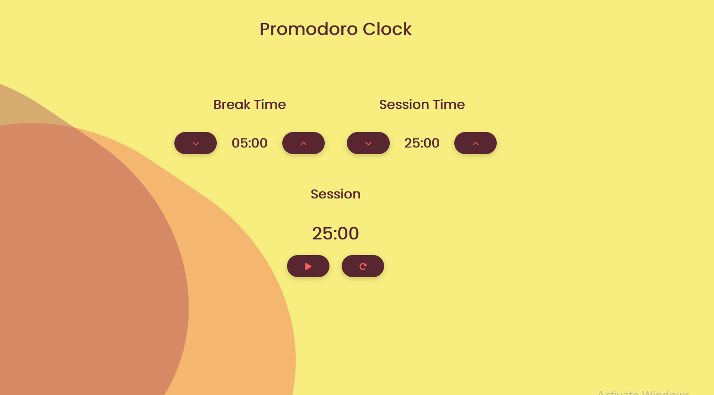

# React Promodoro Clock

This is a react Promodoro Clock for [FreeCodeCamp](https://www.freecodecamp.org/) challenge made using Next Js which is a React framwork by Vercel.

## Getting Started

First, run the development server:

```bash
npm run dev
# or
yarn dev
```

�[Live Site](https://promodoro-clock.netlify.app/)


Open [http://localhost:3000](http://localhost:3000) with your browser to see the project.

## Project Dependencies

This project actually has 3 dependencies  'react' and 'react-dom' and 'next' .


